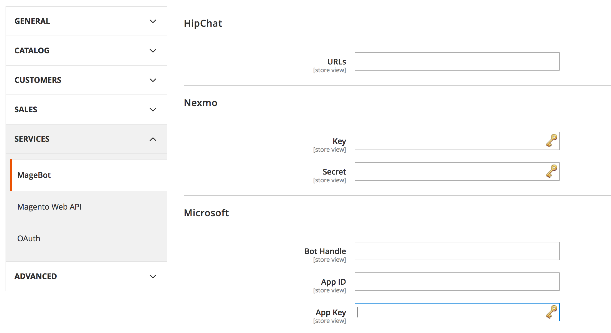

# Magebot

A Magento 2 integration of the botman chatbot framework.

## Installation
You can install the Magebot Module via composer.

## Configuration
To activate the chat bot for your website there are a few steps necessary:

1. Visit the [botman](https://botman.io/configuration) site to configure your chat system.
2. Then add the Tokens, Keys and other necessary stuff to the magento configuration under **"Stores->Configuration->Services->MageBot"**
3. Define your Bot conversation (see [Define your Bot conversation](Define your Bot conversation))

## Define your Bot conversation
//ToDo
